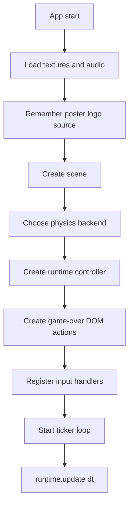
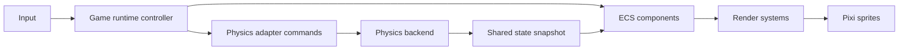
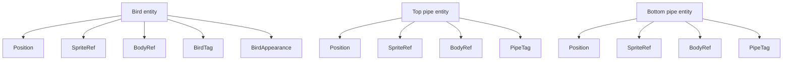
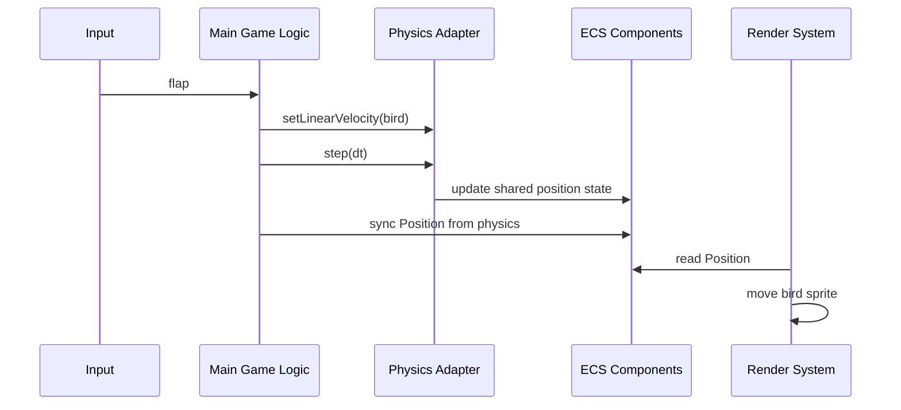
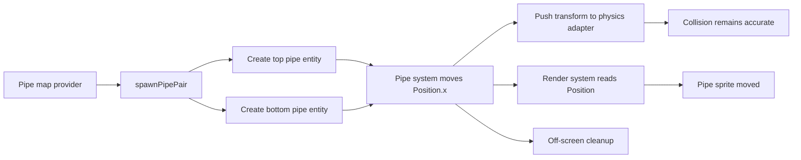
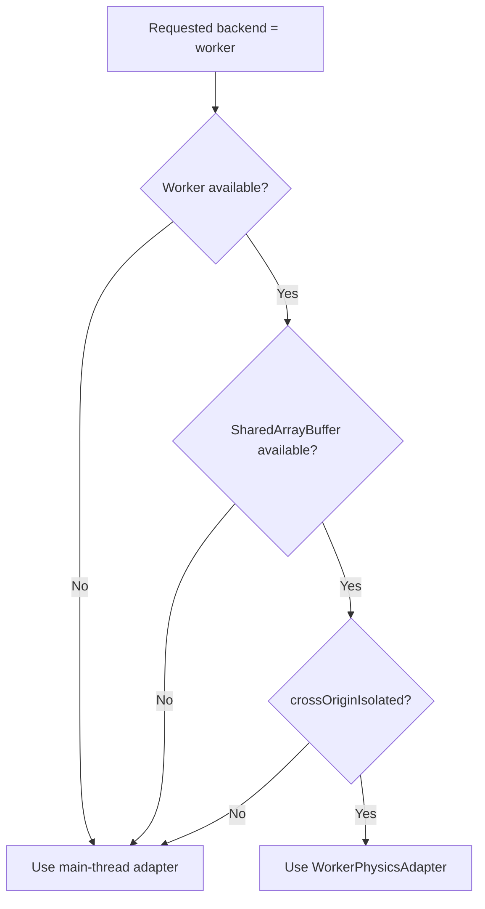
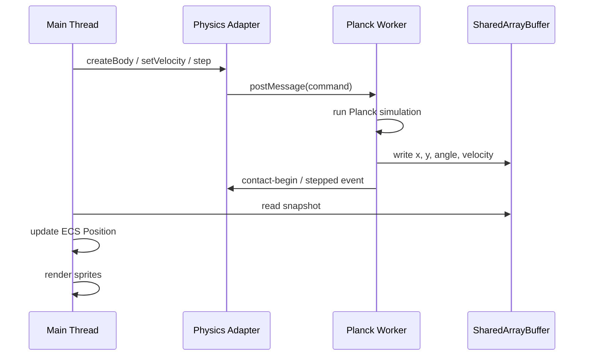
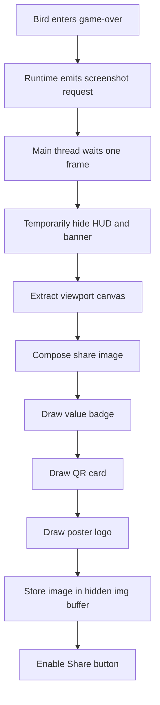

# Flappy ECS Architecture

This document explains the current game flow at a high level and describes how physics is abstracted behind an adapter so the game can run either on the main thread or in a SharedArrayBuffer-backed worker.

## Goals

- Keep gameplay code readable and modular.
- Separate rendering, ECS state, and physics responsibilities.
- Allow physics backend swapping with minimal changes in game logic.
- Prepare the project for future multiplayer synchronization.

## Project Layout

```text
src/
  main.ts                  # Thin bootstrap only
  game/
    app/                   # Bootstrap helpers and runtime composition
    audio/                 # Sound service and SFX helpers
    config/                # Constants and configuration
    ecs/                   # ECS components, shared runtime state, lifecycle helpers
    entities/              # Entity factories (bird, pipe)
    physics/               # Physics adapter, worker protocol, SAB state
    systems/               # Update systems (simulation, presentation, render, pipes, difficulty, map)
    ui/                    # Background and UI helpers
```

## High-Level Runtime Flow

The main entry point is intentionally thin now. It creates the Pixi app, loads assets, remembers the poster logo source for share-image export, creates the scene, selects the physics backend, creates the gameplay runtime controller, wires game-over DOM actions, and then forwards input and ticker updates to that controller.



## App Layer

The `game/app` folder now acts as the composition layer between bootstrap code and gameplay systems.

### Main responsibilities

- `create-scene.ts`: creates Pixi containers and HUD objects
- `create-physics-backend.ts`: selects worker or main-thread physics
- `create-runtime-context.ts`: creates ECS world, stores, queries, bird, and static bounds
- `create-pipe-director.ts`: owns pipe spawning, deterministic pipe map, movement, and cleanup
- `create-game-runtime.ts`: wires the active mode controller into app bootstrap
- `create-bird-crash-controller.ts`: isolates collision resolution and bird crash transitions
- `create-game-over-actions.ts`: creates restart and share DOM controls for the game-over phase
- `create-share-image-capture.ts`: builds the exported share image with gameplay crop, value badge, QR, and logo

The `game/systems` folder now owns the continuous gameplay loop more explicitly:

- `simulation-system.ts`: advances guarded gameplay state, steps physics-backed bird simulation, and resolves score progression from pipe passage
- `presentation-system.ts`: applies scene updates, idle animation, bird pose, ground scroll, and HUD visibility from simulation output
- `gameplay-system.ts`: coordinates simulation output into presentation without putting orchestration back into the app layer
- `offline-round-system.ts`: owns offline-only round start, restart, reset, and flap flow for the current single-player mode
- `pipe-system.ts`: performs ECS pipe movement, pass detection, and cleanup
- `render-system.ts`: syncs physics and ECS state into Pixi sprites

This split keeps `main.ts` small while avoiding over-engineering.

## Explicit Game Phases

The round flow now uses an explicit phase model stored in the runtime resource object:

- `idle`
- `playing`
- `game-over`

This keeps input rules and UI visibility simpler:

- `idle`: the bird bobs in place and waits for the first flap
- `playing`: gravity, pipes, scoring, and collision outcomes are active
- `game-over`: physics finishes the crash/landing flow, share capture is requested once, and restart is only available through the dedicated button

This phase model replaced the earlier boolean-style flow such as separate `started` and `gameOver` checks.

## ECS Flow

The ECS layer stores game state that is useful to rendering and gameplay systems. Rendering does not talk directly to Planck bodies anymore. It reads ECS components, and the ECS state is refreshed from the physics backend when needed.

### Core Components

- `Position`: world position in pixels for rendering.
- `SpriteRef`: index into sprite storage.
- `BodyRef`: physics body handle id.
- `BirdTag`: marks bird entities.
- `PipeTag`: marks pipe entities.
- `BirdAppearance`: identifies bird variant such as yellow or red.

### Runtime Data Ownership

- ECS owns logical entity membership and render-facing component data.
- The physics adapter owns collision shapes, dynamic body simulation, and contact events.
- Pixi owns actual display objects.



## How Bird and Pipe Use ECS

The game does not store a full object-oriented `Bird` class or `Pipe` class with all runtime state inside it. Instead, each game object is represented as an ECS entity plus a small set of components.

This means:

- entity factories create the entity and attach the required components
- systems operate on matching component sets
- rendering reads `Position`
- physics reads or writes through `BodyRef`

### Bird entity

The local bird is built from these components:

- `Position`
- `SpriteRef`
- `BodyRef`
- `BirdTag`
- `BirdAppearance`

What each one means:

- `Position`: the bird position in pixels used by rendering
- `SpriteRef`: where the Pixi sprite is stored
- `BodyRef`: physics body handle id used by the physics adapter
- `BirdTag`: lets systems query only bird entities
- `BirdAppearance`: identifies the bird skin or variant such as yellow or red

The local bird also creates a physics body through the adapter. That body is dynamic, so gravity and flap velocity affect it.

### Remote bird entity

A remote bird is intentionally simpler:

- `Position`
- `SpriteRef`
- `BirdTag`
- `BirdAppearance`

It does not need `BodyRef` if it is only replicated from the network. In that case, the main thread only updates its `Position` from remote snapshots and renders it.

### Pipe entity

Each pipe segment is a separate ECS entity with:

- `Position`
- `SpriteRef`
- `BodyRef`
- `PipeTag`

Important detail: one visual pipe pair is actually two entities.

- one top pipe entity
- one bottom pipe entity

The game stores those two entity ids together in a `PipePair` runtime record so scoring and cleanup can treat them as one obstacle.

### Bird and pipe entity summary



## Bird ECS Lifecycle

The bird lifecycle is split between entity creation, player input, physics sync, and render sync.

### Creation

`createBirdEntity(...)` does the following:

1. creates an ECS entity id
2. attaches bird-related components
3. creates a Pixi sprite
4. creates a physics body through the physics adapter
5. stores the physics body handle id inside `BodyRef`

### Update flow

During gameplay:

1. input calls flap logic
2. flap logic sends velocity commands to the physics adapter
3. physics steps
4. ECS `Position` is refreshed from the physics snapshot
5. render system moves the sprite to the ECS position

During game-over:

1. contact callback switches the runtime phase to `game-over`
2. the bird is allowed to rotate and fall until it lands
3. a one-shot screenshot request flag is emitted
4. the main thread captures a share image and enables the share action
5. restart is handled by a DOM button instead of flap input

### Bird flow diagram



## Pipe ECS Lifecycle

Pipes are driven differently from the bird.

### Creation

`spawnPipePair(...)` creates two pipe entities:

1. top pipe entity
2. bottom pipe entity

Each one gets its own sprite, `Position`, `BodyRef`, and `PipeTag`.

### Movement

Pipe movement is currently gameplay-driven, not physically simulated.

That means:

1. pipe system subtracts horizontal speed from `Position.x`
2. the new pipe transform is pushed into the physics adapter
3. the render system reads `Position` and moves the sprites

This is useful because pipes are deterministic obstacles, so they do not need dynamic physics like the bird.

### Cleanup and scoring

The pipe system also:

- checks when the bird passes a pipe pair and increments the runtime mark
- destroys both pipe entities when they leave the screen
- removes the related physics bodies via the adapter

### Pipe flow diagram



## Physics Adapter Design

The physics layer is intentionally hidden behind a backend-agnostic interface.

### Why the adapter exists

- Main gameplay code should not care whether physics runs on the main thread or in a worker.
- Future multiplayer support may need authoritative or partially replicated simulation.
- Worker-based physics requires message passing and shared memory, which should stay isolated from gameplay code.

### Adapter contract

The adapter exposes operations such as:

- `init()`
- `createBody(...)`
- `destroyBody(...)`
- `setLinearVelocity(...)`
- `setAngularVelocity(...)`
- `setGravityScale(...)`
- `setFixedRotation(...)`
- `setAwake(...)`
- `setTransform(...)`
- `step(dt)`
- `onContact(listener)`

This allows `main.ts`, entity factories, and systems to use one API regardless of backend.

## Physics Backends

There are currently two backends:

### 1. Main-thread adapter

File: `src/game/physics/main-thread-adapter.ts`

Use this when:

- You want simple debugging.
- SharedArrayBuffer is unavailable.
- You want a no-worker fallback.

### 2. Worker adapter

File: `src/game/physics/worker-adapter.ts`

Use this when:

- You want physics off the main thread.
- SharedArrayBuffer is available.
- The page is `crossOriginIsolated`.

## How backend selection works

`main.ts` chooses the backend at startup.

- If worker physics is requested and SAB is available, it uses the worker adapter.
- Otherwise it falls back to the main-thread adapter.



## SharedArrayBuffer Worker Flow

The worker backend uses a SharedArrayBuffer snapshot instead of exposing live Planck body objects to the main thread.

### Why SAB is useful here

- The render loop can read physics state without serializing full body data each frame.
- The worker can step simulation independently and write snapshots into shared memory.
- The main thread only needs ids, positions, angles, and velocities.

### Shared state contents

The shared state currently stores:

- meta/version info
- active flag per physics body
- entity id per physics body
- `x`, `y`
- `angle`
- `velocityX`, `velocityY`

### Worker communication model

Commands still go through `postMessage`, while snapshots are read from SharedArrayBuffer.



## Current Practical Usage

At the moment:

- `main.ts` is only a bootstrap and wiring entry point.
- scene creation is isolated from gameplay runtime.
- runtime context creation is isolated from frame update logic.
- pipe lifecycle is isolated behind a pipe director.
- game-over actions are isolated behind a small DOM helper.
- share-image export is isolated behind a dedicated capture/composition helper.
- The game loop is already wired to the physics adapter.
- Bird and pipe entity factories create bodies through the adapter.
- Render sync reads position from adapter shared state instead of direct Planck objects.
- Collision callbacks also come through the adapter.

This means the game logic is no longer tightly coupled to `planck.World`, and the bootstrap file is no longer responsible for all gameplay decisions.

## Online Map And Score Integrity

Offline mode still uses a client-local deterministic pipe seed.

Online modes now follow a stricter flow:

- the server generates the room seed
- the seed is sent through `RoomSummary.config.seed`
- the web runtime applies that seed before online play starts
- the same deterministic pipe-map rules are shared from `packages/shared`
- the server rebuilds the next expected pipe sequence when validating score claims

This does not make the backend fully authoritative for bird physics yet, but it does make online course generation server-seeded and online score acceptance server-checked.

### Current integrity boundary

Still client-authoritative:

- flap timing
- bird movement
- local collision timing
- raw position telemetry

Now checked by the server for online modes:

- room seed used for pipe generation
- whether a claimed point matches the next expected pipe pair
- whether the bird position was inside the gap when the point was claimed

The client now emits a `scoreTrigger` only when local score increases, and `player:finish` can carry the final pending trigger so the last legitimate point is not dropped when a run ends immediately after scoring.

## Game-Over Actions

The game-over interaction is intentionally split away from the Pixi scene and uses DOM controls instead.

### Current behavior

- `Restart` and `Share` buttons are rendered in a DOM overlay.
- The button group is hidden during `idle` and `playing`.
- The button group becomes visible only during `game-over`.
- Restart no longer happens via tap or space while the game is over.

This avoids accidental restart taps on the canvas and keeps share/download behavior separate from gameplay input.

## Share Image Export Flow

The share image is not just a raw canvas dump anymore. It is composed intentionally for game-over sharing.

### What gets exported

- a cropped gameplay image from the visible viewport
- the current run value rendered as a custom badge
- a QR card pointing to `window.location.href`
- the LCP poster logo in the lower-left corner

### What is excluded

- in-game hint text
- in-game game-over banner
- the normal points HUD text

### Export flow



The hidden `img` buffer is important because the download action uses a stable stored image, not a fresh WebGL canvas capture at click time.

## Requirements for SAB Worker Physics

Worker physics with SharedArrayBuffer only works if all conditions below are true:

- `Worker` exists in the browser.
- `SharedArrayBuffer` exists in the browser.
- `crossOriginIsolated === true`.
- The app is served with:
  - `Cross-Origin-Opener-Policy: same-origin`
  - `Cross-Origin-Embedder-Policy: require-corp`

The Vite config already adds these headers for dev and preview.

## Compatibility Check

You can verify support in the browser console:

```ts
({
  worker: typeof Worker !== 'undefined',
  sharedArrayBuffer: typeof SharedArrayBuffer !== 'undefined',
  crossOriginIsolated,
})
```

## Why this helps multiplayer later

This structure is a good foundation for multiplayer because it separates concerns clearly:

- local render state stays on the main thread
- simulation commands can be routed through a single adapter boundary
- remote players do not need local physics bodies
- deterministic or server-driven map generation can be inserted above the adapter layer

For example:

- local bird: physics-enabled body through adapter
- remote bird: ECS visual entity only, updated from network snapshots
- map: generated authoritatively, then broadcast as commands or seeds

## Tips and Tricks

These are practical guidelines for projects with a similar stack: ECS, Pixi rendering, deterministic obstacles, and adapter-based physics.

### 1. Keep ECS components small and boring

Use ECS components for data, not behavior.

Good examples:

- `Position`
- `BodyRef`
- `BirdAppearance`

Less ideal examples:

- components storing live engine objects with many responsibilities
- components mixing render state, physics state, and networking state together

If a component starts feeling like a mini class, it usually means the responsibility should move into a system or service.

### 2. Do not let render code depend on physics objects

This project is moving in the right direction because Pixi rendering reads ECS state instead of talking directly to Planck bodies.

That separation matters because:

- worker physics becomes possible
- remote entities become easier
- testing gameplay logic becomes simpler

The general rule is:

- physics writes simulation state
- ECS stores frame-usable state
- rendering consumes ECS state

### 3. Use adapters for engine boundaries

Anything likely to change should sit behind an adapter.

In this project, physics is the right place to do that first.

The same pattern can later be reused for:

- networking
- storage or replay recording
- audio event routing

Adapters make it much easier to swap implementation details without rewriting all gameplay code.

### 4. Treat remote entities as replicated data, not simulated entities

For multiplayer, remote birds should usually not run local dynamic physics.

Instead:

- local player bird: physics-enabled
- remote bird: replicated transform and animation state

This avoids divergence and keeps authority boundaries clean.

### 5. Use deterministic generators for shared content

The existing pipe map provider is already a strong decision.

For collaborative or multiplayer obstacle generation, deterministic generation gives you two good options:

- share a seed
- share a stream of generation commands

Both are better than letting each client invent obstacle positions independently.

### 6. Keep your frame loop orchestration thin

`main.ts` should coordinate systems, not absorb all logic forever.

This project is already moving in the right direction with the `game/app` layer. As the project grows further, move these concerns into dedicated systems or services:

- game phase transitions
- run value handling
- crash handling
- backend selection
- multiplayer replication

If one file becomes the only place that “knows everything,” iteration speed will drop fast.

### 7. Log backend decisions early

For projects with optional worker/SAB paths, always log which backend was selected.

That saves a lot of time when debugging:

- physics mismatch
- unsupported browsers
- bad server headers
- stale dev server config

### 8. Add explicit game phases early

Even for a small game, a phase enum or tagged state helps a lot.

Typical phases:

- `idle`
- `playing`
- `game-over`
- later maybe `waiting-room`, `countdown`, `spectating`

This reduces accidental condition overlap like checking `started` and `gameOver` in many places.

### 9. Use one canonical unit per layer

This project already separates pixels and meters with `pxToM` and `mToPx`, which is correct.

Keep that strict:

- rendering layer: pixels
- physics layer: meters
- networking layer: decide one canonical transport unit and stick to it

Mixing units silently is one of the fastest ways to introduce invisible gameplay bugs.

### 10. Prefer command flow over direct mutation

When integrating physics or multiplayer, it is safer to think in commands:

- flap
- spawn pipe pair
- destroy pipe
- reset round

This scales better than many systems directly mutating low-level state in unrelated places.

## Current Pain Points

The project is in a good direction, but there are a few pain points worth naming explicitly.

### 1. Runtime controller still owns several concerns

The refactor improved things a lot, but `create-game-runtime.ts` still coordinates several responsibilities:

- round reset flow
- flap flow
- collision outcomes
- animation timing
- run value updates and tamper checks
- frame orchestration

That is acceptable for this project size, but it is now the next likely hotspot if the game grows.

### 2. ECS state and non-ECS runtime state are still mixed

Some data is stored as ECS components, while other important data lives in plain runtime variables or arrays:

- `pipePairs`
- `pipeMap`
- runtime booleans like crash state
- mark state, tamper guard data, and phase-like state inside a custom resource object

That is not inherently wrong, but it creates multiple state models. As the project grows, it becomes harder to know what should live in ECS versus what should stay as orchestration state.

### 3. Pipe movement is half gameplay state, half collision maintenance

Pipes are moved by gameplay code, then their transform is pushed into physics.

That is a valid design, but it means the pipe system owns both obstacle logic and physics transform sync. If more obstacle types are added later, that pattern can get repetitive unless a shared movement-to-physics sync layer is introduced.

### 4. Adapter migration is still transitional

The physics adapter is now wired, which is good, but the architecture is still in a migration phase.

That means there is still conceptual overhead from supporting both:

- main-thread physics
- worker physics

Until the abstraction settles, debugging can feel heavier because bugs may come from either backend behavior or from the adapter boundary itself.

### 5. SAB setup is fragile in local development

SharedArrayBuffer requires a correct browser and correct server headers.

That creates a real developer experience pain point:

- it may work after restart
- it may silently fall back
- it may fail because the page is not isolated

This is one of the most common sources of confusion in projects using worker-based simulation.

### 6. Contact handling is currently centralized and imperative

Collision outcomes are currently handled in one central callback.

That works for a small game, but if you later add:

- power-ups
- hazards
- multiplayer interactions
- collectible items

the callback can turn into a large conditional block quickly.

### 7. Remote-player architecture is only partially prepared

The code now supports the idea that remote birds do not need physics, which is correct.

But the rest of the multiplayer pipeline still needs to be formalized:

- ownership model
- snapshot format
- reconciliation policy
- room state flow
- map collaboration protocol

So the architecture is prepared conceptually, but not yet operationally.

### 8. There is no dedicated debugging surface yet

This kind of project benefits a lot from lightweight debugging tools, for example:

- current backend label
- bird body position and velocity
- active pipe count
- phase label
- worker compatibility status

Without this, debugging behavior changes can take longer than necessary.

## Recommended Improvements for This Project

If you want the highest return on effort from the current state, these are the next structural improvements I would prioritize.

1. Add a small debug overlay for backend, phase, bird velocity, and SAB compatibility.
2. Formalize which runtime state belongs in ECS, which belongs in services, and which belongs in room or network state.
3. Introduce a network-facing adapter layer similar to the physics adapter.
4. Consider moving game-over DOM action styling and composition into a more explicit UI module if more menu states are added.
5. Consider extracting mark and round-reset flow from `create-game-runtime.ts` if more game modes are added.

## Recommended Next Steps

1. Add a tiny debug overlay showing the active physics backend (`worker` or `main-thread`) and current phase.
2. Introduce a network adapter above the physics adapter for multiplayer commands and snapshots.
3. Decide whether future share-export layouts should remain canvas-composited or move to a template-based export pipeline.
4. Decide whether mark flow should stay inside the runtime controller or move into a dedicated round-state helper.
